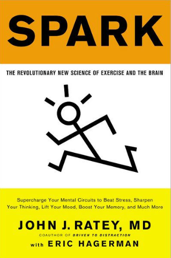

### “Exercise is the single best thing you can do for your brain in terms of mood, memory, and learning.”

#### Exercise as “Miracle-Gro” for the Brain

Ratey introduces the concept of BDNF (Brain-Derived Neurotrophic Factor)—a protein that supports neuron growth and synaptic plasticity. Aerobic activity dramatically increases BDNF levels, essentially fertilizing the brain for learning.

#### ADHD and Executive Function

For those managing ADHD (like many readers I know), the book offers particularly relevant insights. Regular aerobic exercise can improve focus, reduce impulsivity, and enhance executive control—often with effects comparable to medication, but without the side effects. We dig into the practical side of this in [ADHD and Exercise: How Fitness Helps the ADHD Brain](/posts/adhd-and-exercise-how-fitness-helps-the-adhd-brain/).

#### Mood Regulation

The book details how exercise modulates neurotransmitters like serotonin, norepinephrine, and dopamine, making it a potent antidote to anxiety, depression, and stress.(directory including this and similar communities)

#### Real-World Success Stories

From students scoring higher on standardized tests after morning runs to adults reversing age-related cognitive decline, Spark grounds its science in inspiring, tangible outcomes.

### Rating: ⭐⭐⭐⭐ (4/5)

Buy here: https://amzn.to/4svZGux

For more on turning "restlessness as a bug" into "restlessness as a feature," see our review of [Unlocking the ADHD Advantage](/posts/book-review-ADHD-advantage/).
